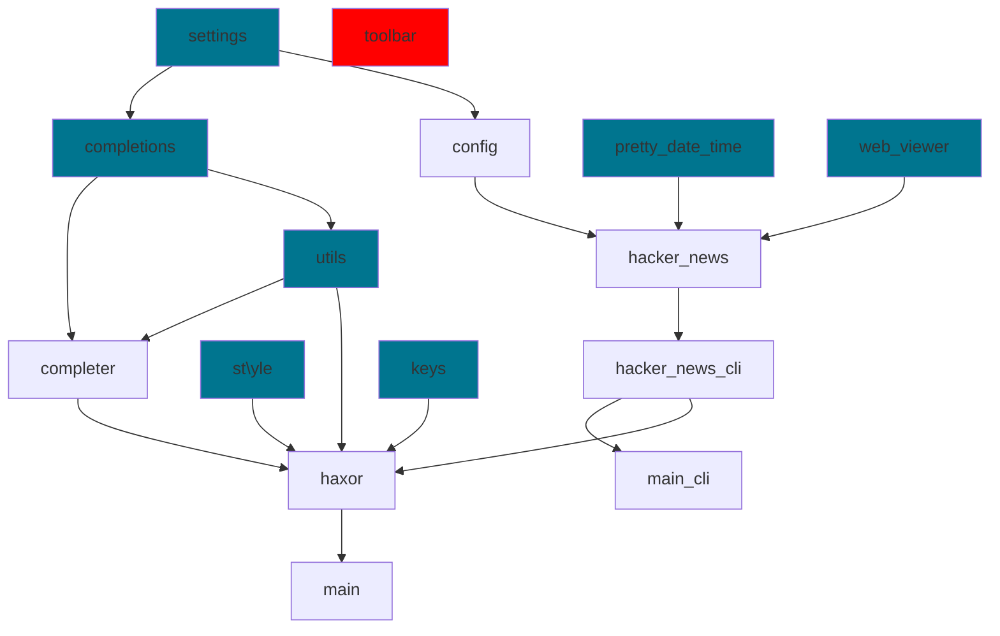

```mermaid
  graph TD;
      settings-->completions;
      completions-->completer;
      haxor-->main;
      st\yle-->haxor;
      hacker_news_cli-->main_cli;
      completions-->utils;
      utils-->completer;
      settings-->config;
      hacker_news-->hacker_news_cli;
      pretty_date_time-->hacker_news;
      config-->hacker_news;
      web_viewer-->hacker_news;
      completer-->haxor;
      hacker_news_cli-->haxor;
      utils-->haxor;
      keys-->haxor;
style settings fill:#00758f
style completions fill:#00758f
style st\yle fill:#00758f
style pretty_date_time fill:#00758f
style keys fill:#00758f
style web_viewer fill:#00758f
style utils fill:#00758f
style toolbar fill:#ff0000
```